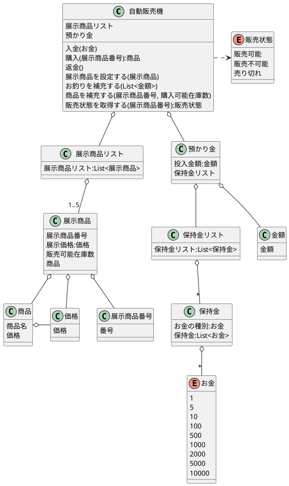

```puml
@startuml
class 自動販売機
{
    展示商品リスト
    預かり金
    入金(お金)
    購入(展示商品番号):商品
    返金()
    展示商品を設定する(展示商品)
    お釣りを補充する(List<金額>)
    商品を補充する(展示商品番号, 購入可能在庫数)
    販売状態を取得する(展示商品番号):販売状態
}

class 展示商品リスト
{
    展示商品リスト:List<展示商品>
}

class 展示商品
{
    展示商品番号
    展示価格:価格
    販売可能在庫数
    商品
}

class 展示商品番号
{
    番号
}

class 商品
{
    商品名
    価格
}

class 預かり金
{
    投入金額:金額
    保持金リスト
}

class 保持金リスト
{
    保持金リスト:List<保持金>
}

class 保持金
{
    お金の種別:お金
    保持金:List<お金>
}

class 金額
{
    金額
}

enum お金
{
    1
    5
    10
    100
    500
    1000
    2000
    5000
    10000
}

class 価格
{
    価格
}

enum 販売状態
{
    販売可能
    販売不可能
    売り切れ
}

自動販売機 o-- 展示商品リスト
自動販売機 o-- 預かり金
自動販売機 .> 販売状態
展示商品リスト o-- "1..5" 展示商品
展示商品 o-- 展示商品番号
展示商品 o-- 価格
展示商品 o-- 商品
預かり金 o-- 保持金リスト
預かり金 o-- 金額
保持金リスト o-- "*" 保持金
保持金 o-- "*" お金
商品 o- 価格
@enduml
```
