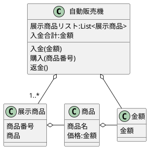

```puml
@startuml
class 自動販売機
{
    展示商品リスト:List<展示商品>
    入金合計:金額
    入金(金額)
    購入(商品番号)
    返金()
}

class 展示商品
{
    商品番号
    商品
}

class 商品
{
    商品名
    価格:金額
}

class 金額
{
    金額
}

自動販売機 o-- "1..*" 展示商品
自動販売機 o- 金額
展示商品 o- 商品
商品 o- 金額
@enduml
```
