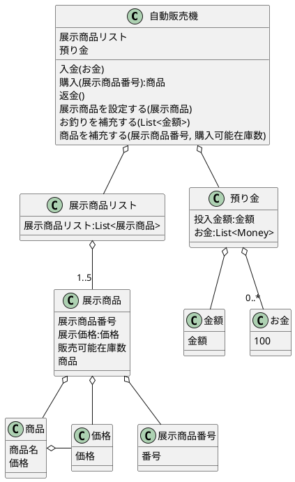

```puml
@startuml
class 自動販売機
{
    展示商品リスト
    預り金
    入金(お金)
    購入(展示商品番号):商品
    返金()
    展示商品を設定する(展示商品)
    お釣りを補充する(List<金額>)
    商品を補充する(展示商品番号, 購入可能在庫数)
}

class 展示商品リスト
{
    展示商品リスト:List<展示商品>
}

class 展示商品
{
    展示商品番号
    展示価格:価格
    販売可能在庫数
    商品
}

class 展示商品番号
{
    番号
}

class 商品
{
    商品名
    価格
}

class 預り金
{
    投入金額:金額
    お金:List<Money>
}

class 金額
{
    金額
}

class お金
{
    100
}

class 価格
{
    価格
}

自動販売機 o-- 展示商品リスト
自動販売機 o-- 預り金
展示商品リスト o-- "1..5" 展示商品
展示商品 o-- 展示商品番号
展示商品 o-- 価格
展示商品 o-- 商品
預り金 o-- "0..*" お金
預り金 o-- 金額
商品 o- 価格
@enduml
```
