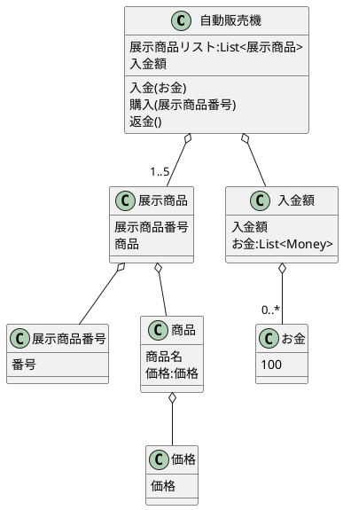

```puml
@startuml
class 自動販売機
{
    展示商品リスト:List<展示商品>
    入金額
    入金(お金)
    購入(展示商品番号)
    返金()
}

class 展示商品
{
    展示商品番号
    商品
}

class 展示商品番号
{
    番号
}

class 商品
{
    商品名
    価格:価格
}

class 入金額
{
    入金額
    お金:List<Money>
}

class お金
{
    100
}

class 価格
{
    価格
}

自動販売機 o-- "1..5" 展示商品
自動販売機 o-- 入金額
展示商品 o-- 展示商品番号
展示商品 o-- 商品
入金額 o-- "0..*" お金
商品 o-- 価格
@enduml
```
