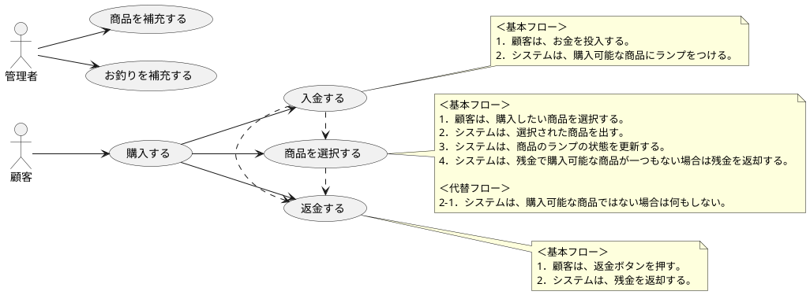

```puml
@startuml
left to right direction

usecase (購入する) as Purches
usecase (入金する) as Post
usecase (商品を選択する) as SelectProduct
usecase (返金する) as Refund
usecase (商品を補充する) as RestockProduct
usecase (お釣りを補充する) as RestockChange

顧客 --> Purches
Purches --> Post
Purches --> SelectProduct
Purches --> Refund
Post .> SelectProduct
Post .> Refund
SelectProduct .> Refund

管理者 --> RestockProduct
管理者 --> RestockChange

note right of Post
＜基本フロー＞
1．顧客は、お金を投入する。
2．システムは、購入可能な商品にランプをつける。
end note

note right of SelectProduct
＜基本フロー＞
1．顧客は、購入したい商品を選択する。
2．システムは、選択された商品を出す。
3．システムは、商品のランプの状態を更新する。
4．システムは、残金で購入可能な商品が一つもない場合は残金を返却する。

＜代替フロー＞
2-1．システムは、購入可能な商品ではない場合は何もしない。
end note

note right of Refund
＜基本フロー＞
1．顧客は、返金ボタンを押す。
2．システムは、残金を返却する。
end note
@enduml
```
